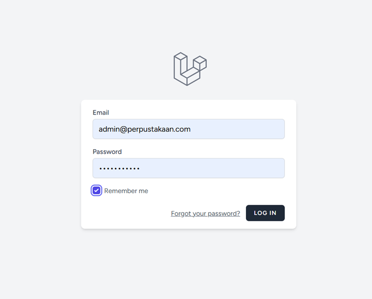
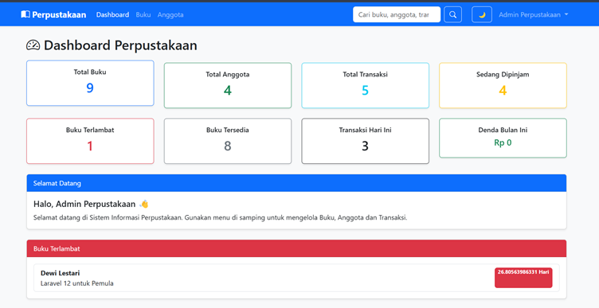

# 📚 Sistem Informasi Perpustakaan

Sistem Informasi Perpustakaan berbasis Laravel 12 yang dibuat untuk memenuhi tugas praktikum Framework Web. Aplikasi ini digunakan untuk mengelola data buku, anggota, transaksi peminjaman dan pengembalian buku secara mudah dan terintegrasi.

---

# 👨‍💻 Author

Nama : Nurul Afni Khasifa

NIM : 60324037

Kelas : Pemrograman Web II

Universitas Islam Negeri K.H. Abdurrahman Wahid Pekalongan

---

# 🚀 Tech Stack

- Laravel 12
- PHP 8.2
- MySQL
- Bootstrap 5
- JavaScript
- SweetAlert2
- Chart.js
- Bootstrap Icons

---

# 📦 Fitur Utama

## Authentication

- Login
- Register
- Logout
- Middleware Authentication

---

## Dashboard

- Total Buku
- Total Anggota
- Total Transaksi
- Buku Dipinjam
- Statistik
- Chart Dashboard
- Quick Action

---

## Manajemen Buku

- Tambah Buku
- Edit Buku
- Hapus Buku
- Detail Buku
- Search Buku
- Filter Buku
- Export CSV
- Bulk Delete

---

## Manajemen Anggota

- Tambah Anggota
- Edit Anggota
- Hapus Anggota
- Detail Anggota
- Search Anggota

---

## Transaksi

- Peminjaman Buku
- Pengembalian Buku
- Update Stok Otomatis
- Perhitungan Denda
- Riwayat Transaksi

---

## Search

- Search Buku
- Search Anggota
- Search Transaksi

---

# ⭐ Fitur Tambahan

✅ Dashboard Chart

✅ Export CSV

✅ Dark Mode

✅ QR Code Buku

✅ Responsive Design

---

# 📂 Struktur Folder

```
app/
 ├── Http/
 │    ├── Controllers
 │    ├── Requests
 │
 ├── Models
 │
resources/
 ├── views/
 │     ├── buku
 │     ├── anggota
 │     ├── transaksi
 │     ├── dashboard
 │
routes/
 ├── web.php

database/
 ├── migrations
```

---

# 💻 Cara Install

## 1 Clone Project

```bash
git clone https://github.com/username/perpustakaan.git
```

---

## 2 Masuk Folder

```bash
cd perpustakaan
```

---

## 3 Install Dependency

```bash
composer install
```

---

## 4 Copy Environment

```bash
cp .env.example .env
```

---

## 5 Generate Key

```bash
php artisan key:generate
```

---

## 6 Setting Database

Buat database

```
perpustakaan_laravel
```

Lalu edit file

```
.env
```

```
DB_DATABASE=perpustakaan_laravel
DB_USERNAME=root
DB_PASSWORD=
```

---

## 7 Jalankan Migration

```bash
php artisan migrate
```

---

## 8 Jalankan Seeder (Jika Ada)

```bash
php artisan db:seed
```

---

## 9 Jalankan Server

```bash
php artisan serve
```

Buka

```
http://localhost:8000
```

---

# 🔑 Akun Login

Name

```
Admin Perpustakaan
```

Email

```
admin@perpustakaan.com
```

password

```
password123
```

---

# 📸 Screenshot

## Login



---

## Dashboard



---

## Daftar Buku


---

## Daftar Anggota


---

## Transaksi


---

# 📊 Database

Menggunakan MySQL dengan tabel

- users
- buku
- anggota
- transaksi
- migrations

---

# ✔ Testing

| Fitur | Status |
|--------|--------|
| Login | ✅ |
| Register | ✅ |
| CRUD Buku | ✅ |
| CRUD Anggota | ✅ |
| CRUD Transaksi | ✅ |
| Search | ✅ |
| Export CSV | ✅ |
| Dashboard | ✅ |
| QR Code | ✅ |
| Dark Mode | ✅ |

---

# 📄 Lisensi

Project ini dibuat untuk keperluan pembelajaran Framework Web menggunakan Laravel.
